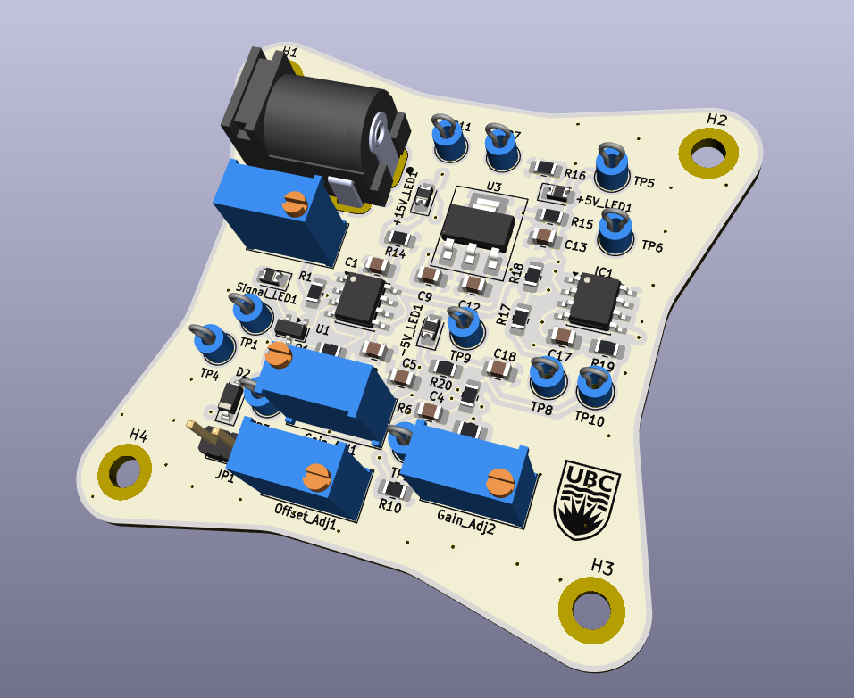
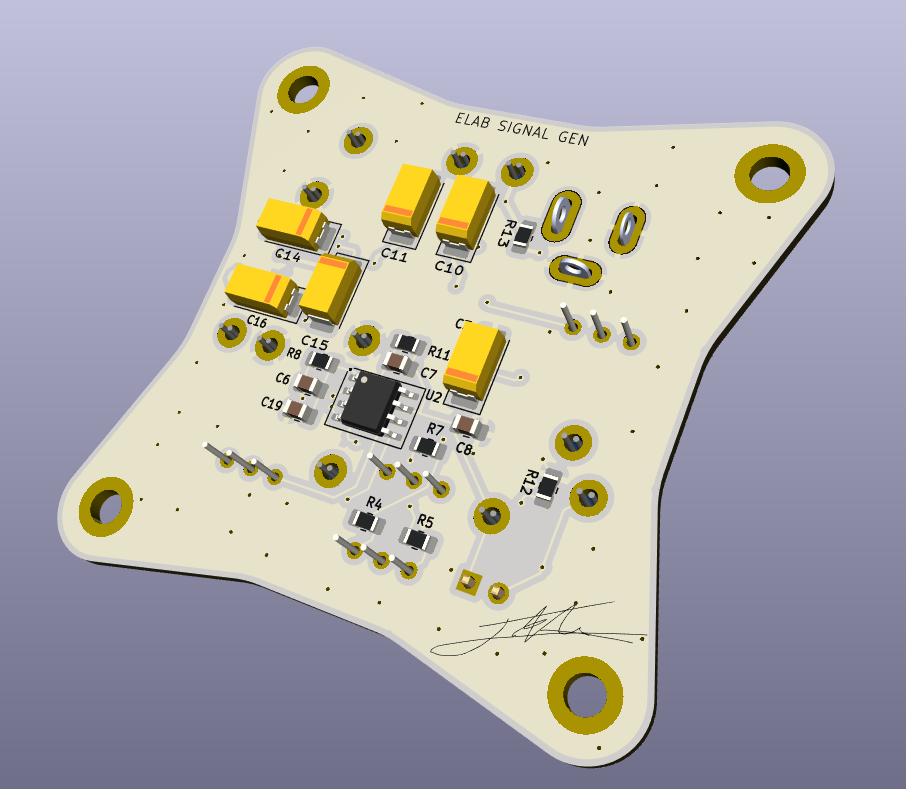

# ELAB-Signal-Generator
A square wave generator with adjustable frequency, gain, and offset control. Designed as a part of UBC's ELAB PCB design course.

### **Skills used in this project**
***KiCad, Analog Circuit Design, Hand Soldering, Testing/Validation***

---

  
  

# Design
The design for this signal generator is not complex, this is because it's main purpose was to provide an opportunity to design and assemble a PCB from
the start to finish of the production cycle. This included schematic capture, component/footprint library creation, component layout, laying traces, and
laying polygon pours. In the second stage of the course, we received our boards and components and assembled them using hand soldering, and tested them using
an oscilloscope to view our signals and test the various adjustments

The design features two power rails, a -5V rail generated by the **MAX889**, as well as a +5V rail regulated by a **LM7805** down from 15V. The square wave signal
is generated by the **NE555** with a frequency adjust. This is then fed to the **AD8039** with two amplifier stages to control gain and offset. 

# Testing

# Notes
