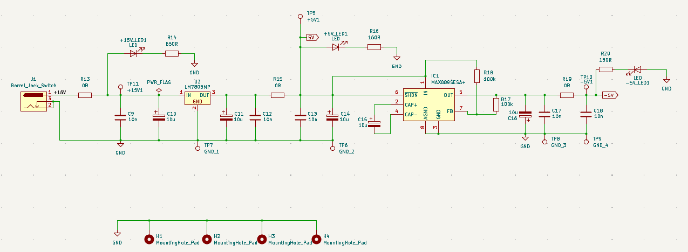
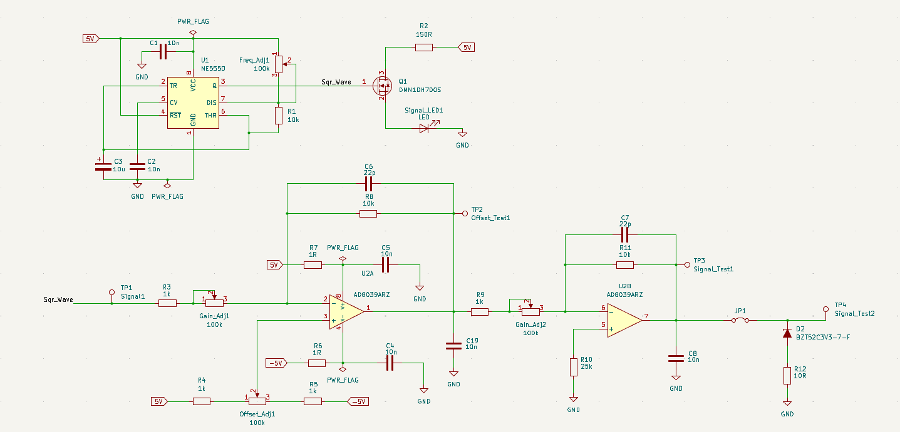

# ELAB-Signal-Generator
A square wave generator with adjustable frequency, gain, and offset control. Designed as a part of UBC's ELAB PCB design course.

### **Skills used in this project**
***KiCad, Analog Circuit Design, Hand Soldering, Testing/Validation***

---

  
  

# Design
The design for this signal generator is not complex, this is because it's main purpose was to provide an opportunity to design and assemble a PCB from
the start to finish of the production cycle. This included schematic capture, component/footprint library creation, component layout, laying traces, and
laying polygon pours. In the second stage of the course, we received our boards and components and assembled them using hand soldering, and tested them using
an oscilloscope to view our signals and test the various adjustments.

## Power Supply
The signal generator utilizes +/-5V rails to be able produce a maximum of a 10V peak-to-peak
signal. 15V  comes from a barrel jack connections from a wall adapter, which is then 
regulated using the **LM7805** to drop to it to +5V. This rail then feeds into the **MAX889** that
produces the complimentary -5V rail. Output capacitors are used to help with input noise, and output voltage ripple.

  

## Signal Amplifier
The square wave signal is generated by the **NE555**, that includes a frequency adjust potentiometer. This signal is then fed to 
the **AD8039** with two amplifier stages to control gain and offset respectively. Additional bypass capacitors are placed
on the op-amps power rails to help with further noise reduction and to help stabilize voltage. Finally, a 3.3V peak-limiter zener
diode is placed on the output which can be engaged with the use of a jumper. 

  

# Assembly

# Testing

# Notes
